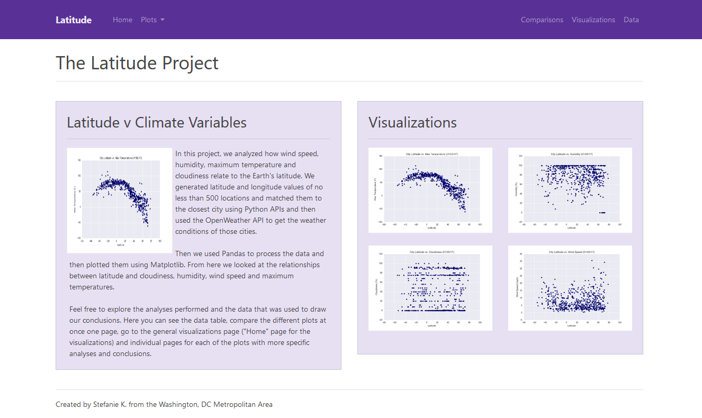

# Displaying Data Using HTML & CSS

## Background
We are using images from a previous project. This project required us to create images with Pandas and Matplotlib. The project required us to use CitiPy and a random number generator. With these libraries, we got random number which represent the latitude and longitunde coordinates from around the world. Then using CityPy, we looked at the closest city to that coordinate to get certain weather statistics such as wind speed, temperatures, humidity. Using those weather statistics we tried to create a relationship of how the latitude correlates to the different weather statistics itself. Some of the weather statistics were better correlated than others.

In this project we had to create a couple of HTML pages that show different items. There is the home page which explains the site contents, a data page which has a table containing the data used, a visualization page containing each individual page and lastly a comparison page.

Optionally, I also included pages for each variable that was measured in the analysis. There are seperate pages for Cloudiness, Wind Speed, Humidity and Maximum Temperature.

To complete this HTML, Bootstrap and Bootswatch CSS were used.

Attached is a Word document that contains screen shots that show what each page looks like. But here is a preview of the Home page.

## Home Page Preview
